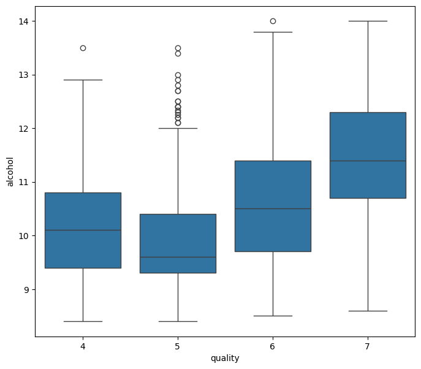

# Wine-Classifcation
It contains various chemical properties of different wine samples, and each sample is labeled as either red or white wine based on its characteristics. The dataset typically includes features such as acidity levels, residual sugar, alcohol content, and other chemical attributes that influence the quality and characteristics of the wine.

## Objective

- Provided analsysis and modeling wine dataset 

## Data Dictionary  

| Column Name          | Type   | Description |
| -------------------- | ------ | ----------- |
| fixed acidity        | float  |             |
| volatile acidity     | float  |             |
| citric acid          | float  |             |
| residual sugar       | float  |             |
| chlorides            | float  |             |
| free sulfur dioxide  | float  |             |
| total sulfur dioxide | float  |             |
| density              | float  |             |
| pH                   | float  |             |
| sulphates            | float  |             |
| alcohol              | float  |             |
| quality              | int    |             |
| red_wine             | string |             |

Its a work in progress, description will be added.

## Summary

### Data Cleaning
No data clean was preformed on the dataset, no missing values or special character. Outliers were deteched and removed..

## Key Visualization 

### Visualization 1: [Quality of Alcohol]
After removing the outliers, we can see that the graph has shurnk and now has only 4 levels. We can still see some of outliers in level 5 quality still have some outliers, futhuremore level 7 has continues to show have more alchol

### Visualization 2: [citric acid levels]
This scatterplot shows the amount of `citric acid` and  `residiual suger` along with the amount of `pH` in every bottle. The data here shows a different story, with residual suger and citric acid been around `0.2` to `0.4`, with most bottle having around `0.3` in `citric acid`

### Visualization 3: [Alcohol Content by pH Levels]
This is a scatterplot chart that shows the `sulphates` to `total sulfur dioxide` in the wine. The mediam suggest to be between 0.4 to 0.5 with the most of wine having 0.5.1 amount of sulphates.

The data suggest that `sulphates` is used to "prevent oxidation".

## Conclusion Recommendation 

I used 6 models to test the data. 
- KNeighborsRegressor
- KNeighborsClassifier
- LinearRegression
- RandomForestRegressor
- LogisticRegression
- RandomForestClassifier

Below are the results:
| Model                  | Score |
| ---------------------- | ----- |
| KNeighborsRegressor    |       |
| KNeighborsClassifier   |       |
| LinearRegression       |       |
| RandomForestRegressor  |       |
| LogisticRegression     |       |
| RandomForestClassifier |       |

The models didn't come out what I expect to be, I will preform fit and test them.
