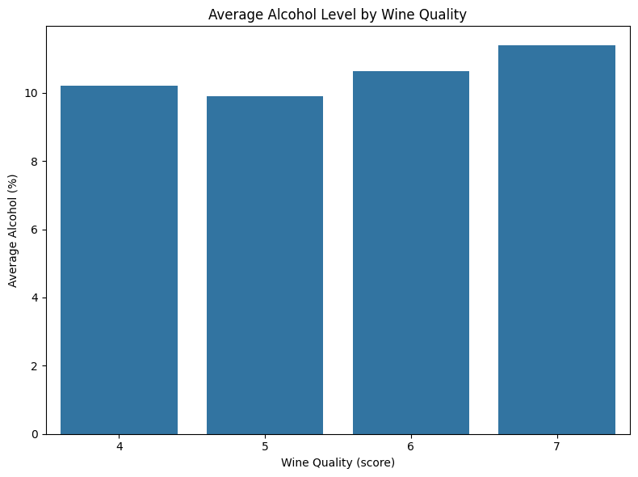
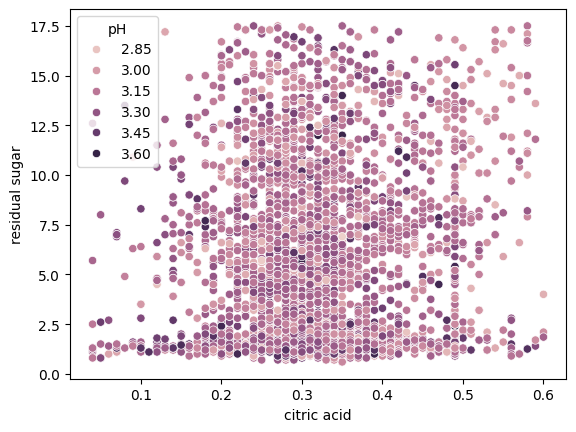
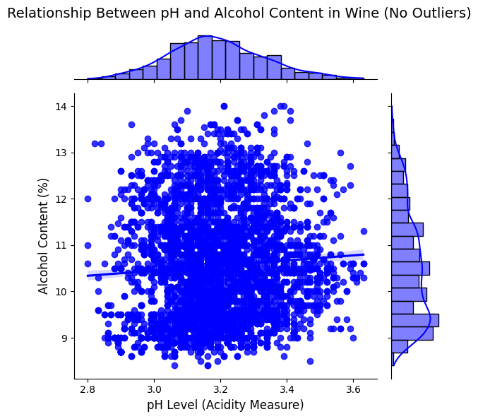

# Wine-Classifcation
It contains various chemical properties of different wine samples, and each sample is labeled as either red or white wine based on its characteristics. The dataset typically includes features such as acidity levels, residual sugar, alcohol content, and other chemical attributes that influence the quality and characteristics of the wine.

## Objective

- Provided analsysis and modeling wine dataset 

## Data Dictionary  

| Column Name          | Type   | Description                                                                                                   |
| -------------------- | ------ | ------------------------------------------------------------------------------------------------------------- |
| fixed acidity        | float  | The amount of fixed acids in the wine, which is typically a combination of tartaric, malic, and citric acids. |
| volatile acidity     | float  | The amount of volatile acids in the wine, primarily acetic acid.                                              |
| citric acid          | float  | The amount of citric acid in the wine, contributing to the overall acidity.                                   |
| residual sugar       | float  | The amount of sugar remaining after fermentation.                                                             |
| chlorides            | float  | The amount of chlorides in the wine, which can indicate the presence of salt.                                 |
| free sulfur dioxide  | float  | The amount of free sulfur dioxide in the wine, used as a preservative.                                        |
| total sulfur dioxide | float  | The total amount of sulfur dioxide, including bound and free forms.                                           |
| density              | float  | The density of the wine, related to alcohol and sugar content.                                                |
| pH                   | float  | The pH level of the wine, indicating its acidity.                                                             |
| sulphates            | float  | The amount of sulphates in the wine, contributing to its taste and preservation.                              |
| alcohol              | float  | The alcohol content of the wine in percentage.                                                                |
| quality              | int    | The quality of the wine, rated from 3 to 9, with higher values indicating better quality.                     |
| red_wine             | string |                                                                                                          

## Summary

### Data Cleaning
No data clean was preformed on the dataset, no missing values or special character. Outliers were deteched and removed..

## Key Visualization 

### Visualization 1: [Quality of Alcohol]
This is a bar plot of the quality of Alcohol, from this graph you can see there quality of alcohol wine.
You can also see the the level of Quality 5 wine out ranks level of Quality 4 wine by just a couple of inches. Futhuremore,the level of Quality 6 line is also close to level of 4. 

### Visualization 2: [citric acid levels]
This scatterplot shows the amount of `citric acid` and  `residiual suger` along with the amount of `pH` in every bottle. The data here shows a different story, with residual suger and citric acid been around `0.2` to `0.4`, with most bottle having around `0.3` in `citric acid`

### Visualization 3: [Alcohol Content by pH Levels]
This is a scatterplot chart that shows the `sulphates` to `total sulfur dioxide` in the wine. The mediam suggest to be between 0.4 to 0.5 with the most of wine having 0.5.1 amount of sulphates.

The data suggest that `sulphates` is used to "prevent oxidation".

## Conclusion Recommendation 

I used 5 models to test the data. 

- LinearRegression
- RandomForestRegressor
- KNeighborsClassifier
- LogisticRegression
- RandomForestClassifier

Below are the results:
| Model                  | Score |
| ---------------------- | ----- |
| LinearRegression       | 0.16  |
| RandomForestRegressor  | 0.26  |
| KNeighborsClassifier   | 0.53  |
| LogisticRegression     | 0.52  |
| RandomForestClassifier | 0.67  |

As you can see the Regression model didn't do that well, but the classifier way better. 

